# 🚀 Tool Whisperer: Building a Conversational Jira Assistant with Streamlit and MCP

*This article continues my exploration of practical MCP implementations, building on the [Confluence case study](https://medium.com/@pawan-kumar94/building-better-ai-integrations-with-model-context-protocol-a-confluence-case-study-ef502364369e) published earlier. Here, we'll dive into more advanced concepts and architectural patterns.*

In the rapidly evolving landscape of AI applications, creating seamless interactions between natural language interfaces and specialized tools remains a significant challenge. After successfully implementing MCP for Confluence integrations, I turned my attention to Jira—another critical enterprise tool that benefits tremendously from conversational interfaces.

This article explores the architecture and implementation details of a Streamlit-based Jira Assistant that leverages MCP for tool calling, focusing on advanced patterns and solutions to common challenges.

## From Confluence to Jira: Expanding MCP Applications

In my previous article, I covered how MCP provides a standardized way for language models to discover and call tools. Building on that foundation, this implementation introduces several advanced concepts:

- Stateful interactions in a web application context
- Multi-modal user interfaces with both conversational and form-based inputs
- Complex parameter extraction from natural language
- Improved error handling and feedback mechanisms

## Architecture: A Three-Tier Approach

Our Jira Assistant application follows a three-tier architecture that separates concerns while maintaining flexibility:

```mermaid
graph TD
    subgraph "Presentation Layer"
        A[Streamlit UI] --> B[Chat Interface]
        A --> C[Ticket Creation Form]
        A --> D[Search Interface]
    end
    
    subgraph "Business Logic Layer"
        B --> E[NL Understanding]
        C --> F[Form Validation]
        D --> G[Query Builder]
        E --> H[MCP Client]
        F --> H
        G --> H
    end
    
    subgraph "Tool Execution Layer"
        H --> I[MCP Server]
        I --> J[Jira API Tools]
        J --> K[Jira Cloud]
    end
    
    style A fill:#4ECDC4
    style H fill:#FF6B6B
    style I fill:#FF6B6B
    style K fill:#1D3557
```



*Note: The live application screenshots will be included in the Medium post to showcase the UI and interactions.*

### How the Components Interact

1. **User Interface (Streamlit)**: Provides multiple interaction methods—chat, forms, and search interfaces.
2. **Business Logic**: Processes user inputs, extracts parameters, and validates data.
3. **MCP Client**: Connects to the MCP server using standardized protocols.
4. **MCP Server**: Hosts tool definitions and handles execution.
5. **Jira Tools**: Implement the actual API calls to Jira.

The real magic happens in how these components communicate. When a user types a request like "Create a bug in the KAN project about login failures," our application:

1. Parses the request to extract key information
2. Maps this to the appropriate tool parameters
3. Calls the tool through MCP
4. Returns the results in a user-friendly format

## Advanced Implementation Details

### Setting up the MCP Client

The core of our implementation involves connecting Streamlit to an MCP server:

```python
async def call_tool(tool_name, params):
    try:
        from mcp import ClientSession, StdioServerParameters
        from mcp.client.stdio import stdio_client
        
        server_params = StdioServerParameters(
            command="python",
            args=[MCP_SERVER_PATH],
            env=None
        )
        
        async with stdio_client(server_params) as (read, write):
            async with ClientSession(read, write) as session:
                await session.initialize()
                
                # Call the tool
                result = await session.call_tool(tool_name, arguments=params)
                
                # Extract and return content
                if hasattr(result, 'content') and result.content:
                    content_item = result.content[0]
                    if hasattr(content_item, 'text'):
                        return content_item.text
                
                return str(result)
    except Exception as e:
        return f"Error: {str(e)}"
```

This function creates a standardized way to call any tool registered with our MCP server, handling the connection, execution, and response parsing.

### Natural Language Understanding

For the chat interface to work effectively, we need to extract structured parameters from natural language:

```python
def extract_ticket_info(text):
    # Use regex to find project key, summary, description, and issue type
    project_match = re.search(r'(?:project\s+(?:key\s+)?|in\s+)([A-Z0-9]+)', text, re.IGNORECASE)
    summary_match = re.search(r'(?:title|summary)[=:]?\s*["\']([^"\']+?)["\']', text, re.IGNORECASE)
    description_match = re.search(r'description[=:]?\s*["\']([^"\']+?)["\']', text, re.IGNORECASE)
    issue_type_match = re.search(r'(?:a\s+)?([Bb]ug|[Tt]ask|[Ss]tory|[Ee]pic)', text, re.IGNORECASE)
    
    # Extract and return information
    # ...
```

While not as sophisticated as a large language model's parameter extraction, this approach provides reliable results for common patterns while keeping the application lightweight.

## Benefits of the Advanced MCP-Streamlit Integration

### 1. Separation of Concerns

The MCP architecture enforces a clean separation between:
- Presentation (Streamlit UI)
- Business logic (parameter extraction)
- Tool execution (MCP server)

This makes the codebase more maintainable and easier to extend.

### 2. Tool Discovery and Documentation

MCP provides built-in mechanisms for tool discovery, allowing the application to adapt to available tools:

```python
async def get_tools():
    # Connect to MCP server
    # ...
    
    tools_result = await session.list_tools()
    return tools_result.tools
```

This enables dynamic UI generation based on the tools currently available on the server.

### 3. Consistent Error Handling

The MCP framework standardizes error responses, making it easier to provide meaningful feedback to users:

```python
# In Streamlit app
try:
    result = loop.run_until_complete(search_jira_tickets(jql_query))
    # Display results
except Exception as e:
    st.error(f"Error searching tickets: {str(e)}")
    st.warning("Tip: Make sure your JQL syntax is correct.")
```

### 4. Easy Extension to New Tools

Adding a new tool requires minimal changes to the client application. Simply:
1. Implement the tool on the MCP server
2. Update the UI to expose the new functionality

The client-server communication remains unchanged.

## Challenges and Solutions

### Asynchronous Execution in Streamlit

Streamlit isn't built for async operations, but MCP's client requires async calls. We solved this with explicit event loops:

```python
loop = asyncio.new_event_loop()
asyncio.set_event_loop(loop)
result = loop.run_until_complete(call_tool("create_jira_ticket", params))
loop.close()
```

### Parameter Name Consistency

We encountered validation errors when parameter names didn't match between client and server:

```
Error executing tool: 1 validation error for Arguments
query Field required [type=missing, input_value={'jql_query': '...'}, input_type=dict]
```

The solution was to ensure client-side parameter names matched the server's expectations:

```python
params = {
    "query": query  # Must match the parameter name in the MCP tool definition
}
```

## Future Directions

Building on our experiences with Confluence and now Jira integrations, several exciting avenues for further development emerge:

1. **Streaming Responses**: Implementing streaming for long-running operations
2. **Tool Chaining**: Executing sequences of tools based on complex requests
3. **Enhanced NLU**: Using LLMs for more sophisticated parameter extraction
4. **Multi-Modal Input**: Supporting image uploads for screenshot-based bug reports

## Conclusion

The Jira Assistant represents another step in our journey of building practical, user-friendly AI-powered applications using MCP. By standardizing how tools are called, documented, and executed, MCP allows developers to focus on user experience instead of worrying about the integration details between systems.

This project demonstrates how rapidly we can build sophisticated AI applications when we have the right architectural patterns in place. From Confluence to Jira—and beyond—MCP provides a consistent foundation for tool integration that scales across different domains and use cases.

---

*This article continues my exploration of practical MCP applications. The complete code for the Jira Assistant is available in our repository. The research and findings presented here were powered by Google's Gemini model. Screenshots of the application in action will be included in the online version of this article.* 